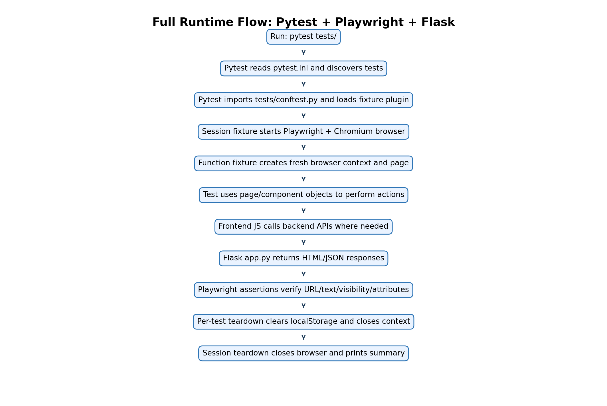
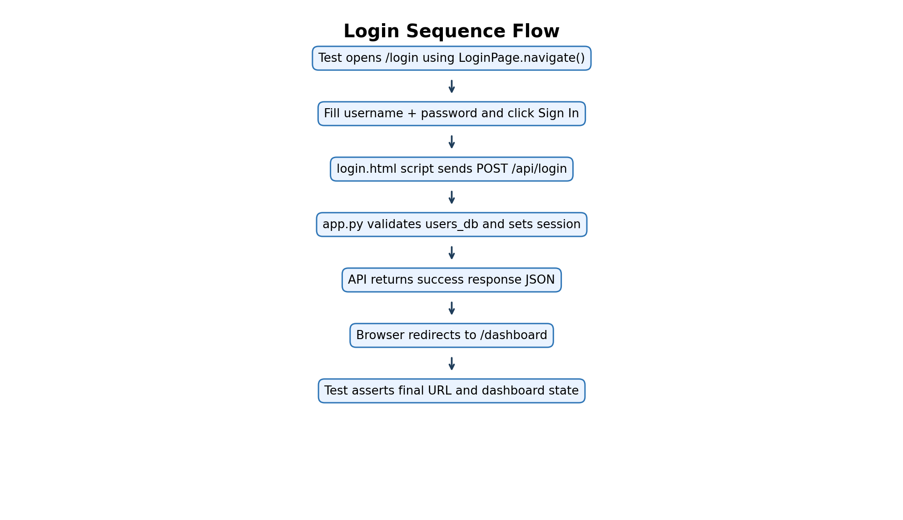
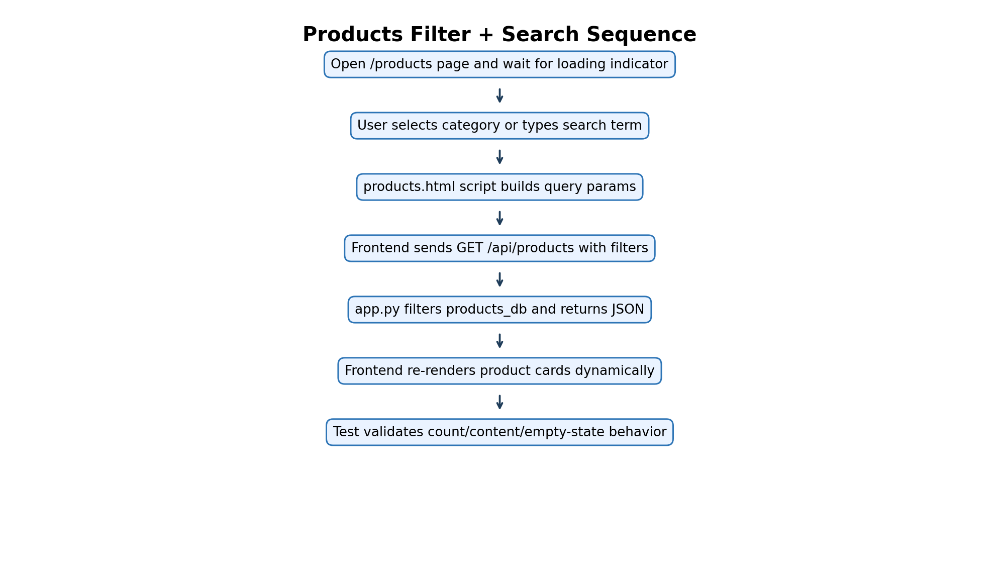
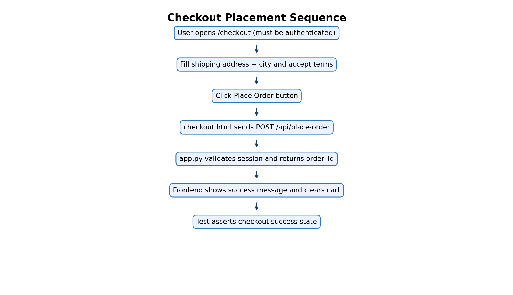
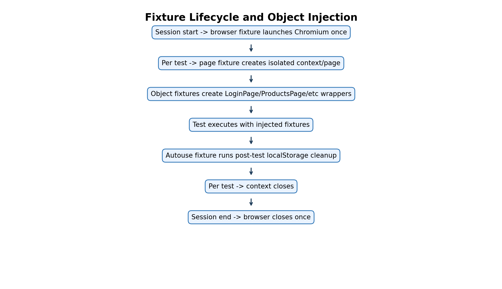

# Playwright Automation Implementation Guide (Beginner Friendly, End-to-End)

**Task : Read ,Explore,Run Test ,Ask**

## Who this document is for

This guide is written for a fresher who is learning automation testing with Playwright for the first time.

You will understand:

- What each file in this project does.
- Why the project is split into layers.
- How execution happens from start to end.
- How UI code and automation code connect.
- How to extend this project safely.

---

## 1. Big Picture: What this project actually is

This repository has **two parts working together**:

1. **Application under test (AUT)**

   - Built using Flask (`app.py`) and HTML templates (`templates/`)
   - This app runs on `http://localhost:5000`
   - It has login, register, products, forms, and components pages
2. **Automation framework**

   - Built using Pytest + Playwright (`tests/`)
   - It opens a real browser, interacts with the app, and verifies behavior

Think of it this way:

- `templates/ + app.py` = the website you are testing
- `tests/` = the test engineers’ code that checks if the website works correctly

---

## 2. Learning roadmap for a fresher

If you are new, follow this order:

1. Read `requirements.txt` and `pytest.ini` to understand dependencies and test rules.
2. Read `app.py` to understand what backend routes and APIs exist.
3. Open `templates/base.html` to understand shared page structure and common `data-testid`s.
4. Read `tests/specs/auth/test_authentication.py` to see the style of tests.
5. Read `tests/pages/app_pages.py` to learn Page Object Model usage.
6. Read `tests/locators/app_locators.py` to understand locator centralization.
7. Read `tests/fixtures/base_fixtures.py` to understand fixture lifecycle.
8. Move to advanced tests in `tests/specs/forms/` and `tests/specs/components/`.

---

## 3. Setup and run (with explanation)

### 3.1 Install Python dependencies

Command:

```bash
pip install -r requirements.txt
```

What happens:

- Installs Flask (web app runtime)
- Installs Pytest (test runner)
- Installs Playwright + plugin (browser automation)

### 3.2 Install browser binaries

Command:

```bash
playwright install
```

What happens:

- Downloads Chromium/WebKit/Firefox binaries used by Playwright
- Without this, tests cannot launch browser

### 3.3 Start application

Command:

```bash
python app.py
```

What happens:

- Flask starts local server at `http://localhost:5000`
- Pages and APIs become available

### 3.4 Run tests

Command:

```bash
pytest tests/
```

What happens:

- Pytest discovers test files by rules in `pytest.ini`
- Loads fixtures from `tests/conftest.py`
- Launches browser and executes tests

---

## 4. End-to-end execution sequence (deep dive)

This is the most important section for freshers.

### Phase A: Pytest bootstraps

1. You run `pytest tests/`
2. Pytest reads `pytest.ini`
3. Pytest starts test collection from `tests/`
4. Pytest imports `tests/conftest.py`
5. `conftest.py` registers plugin: `tests.fixtures.base_fixtures`

### Phase B: Fixtures prepare runtime

For every test session:

1. `browser` fixture (scope=session) starts Playwright + Chromium

For every test function:

1. `page` fixture creates a fresh browser context and page
2. Optional fixtures create objects like `LoginPage`, `ProductsPage`, `NavigationComponent`
3. `autouse` cleanup fixture (`clear_local_storage`) is ready to run after the test

### Phase C: Test function logic runs

Example test:

- `test_successful_login_with_test_ids(login_page, page)`

Execution path:

1. Pytest injects `login_page` object
2. `login_page.navigate()` opens `/login`
3. `login_page.login(...)` fills form and clicks submit
4. Page JS calls `/api/login` in backend
5. Backend validates and responds
6. Browser redirects to `/dashboard`
7. Test asserts URL

### Phase D: Teardown and cleanup

After each test:

1. `clear_local_storage` runs cleanup logic
2. `page` context closes

After all tests:

1. `browser` closes
2. Process exits with report summary

---

## 5. Why this architecture is used

### 5.1 Locator Contract Layer

File: `tests/locators/app_locators.py`

Why:

- If `data-testid` changes in UI, update in one place
- Avoid repeating raw strings in many files

### 5.2 Page Object Model (POM)

File: `tests/pages/app_pages.py`

Why:

- Tests should say **what business action** to do, not low-level selector details
- Example: `login_page.login("user", "pass")` is easier to read than multiple fill/click lines in every test

### 5.3 Component Object Model

File: `tests/components/common_components.py`

Why:

- Some UI pieces are reused across pages (navbar, modal, alerts)
- Encapsulate once, use everywhere

### 5.4 Fixtures as dependency injection

File: `tests/fixtures/base_fixtures.py`

Why:

- Reusable setup/teardown
- Cleaner tests with fewer boilerplate lines
- Consistent browser lifecycle

### 5.5 Specs layer

Files: `tests/specs/**`

Why:

- Keep test intent readable
- Organize by feature area (auth/products/forms/components)

---

## 6. Full file-by-file explanation

Every file in this repository is explained below.

## 6.1 Root files

### `app.py`

**What it is:**

- Main Flask application file.

**What it contains:**

- App initialization and secret key.
- In-memory mock data:
  - `users_db`
  - `products_db`
- Page routes:
  - `/`, `/login`, `/register`, `/products`, `/product/<id>`, `/cart`, `/checkout`, `/dashboard`, `/profile`, `/forms`, `/components`
- API routes:
  - `/api/login`
  - `/api/register`
  - `/api/products`
  - `/api/place-order`
  - `/api/update-profile`
- Session handling (`session['user']`, `session['role']`)

**Why this matters to automation:**

- Tests need a predictable backend to validate UI workflows.
- Login/registration/product APIs drive UI behavior used in tests.
- Role-based dashboard rendering allows admin vs user assertions.

**Execution context:**

- Runs when you start app with `python app.py`.
- Flask serves templates and API responses consumed by browser automation.

---

### `pytest.ini`

**What it is:**

- Central Pytest config file.

**Key settings in this project:**

- `testpaths = tests`
- Naming conventions for test files/classes/functions
- Default options:
  - `-v`
  - `--tb=short`
  - `--strict-markers`
- Marker definitions (`smoke`, `auth`, `products`, etc.)

**Why this matters:**

- Standardizes how tests are discovered and reported.
- Prevents marker mistakes when `--strict-markers` is enabled.

**Execution context:**

- Read automatically on `pytest` command.

---

### `requirements.txt`

**What it is:**

- Python package dependency list.

**Packages used:**

- `flask==3.0.0`
- `pytest==7.4.3`
- `pytest-playwright==0.4.3`
- `playwright==1.40.0`

**Why this matters:**

- Ensures reproducible environment.
- Avoids “works on my machine” issues.

---

### `README.md`

**What it is:**

- Project overview document.

**Why this matters:**

- Explains intent, architecture patterns, and usage commands.
- Good orientation before code-level learning.

---

### `QUICKSTART.md`

**What it is:**

- Rapid setup/run guide.

**Why this matters:**

- Helps fresher run app and tests quickly before deep code study.

---

## 6.2 Static files

### `static/js/main.js`

**What it does:**

- Logs app load message.
- On `DOMContentLoaded`, reads cart from `localStorage` and updates `data-testid="cart-count"`.

**Why this matters for tests:**

- Cart count is validated in product/cart scenarios.
- Gives consistent cart indicator state across pages.

---

### `static/css/style.css`

**What it does:**

- Provides styles for layout, navbar, hero, forms, cards, components.

**Why this matters for tests:**

- UI visibility/hide-show behavior often depends on CSS state.
- Components like modal, dropdown, toast rely on style changes that tests assert.

---

## 6.3 Templates folder (application UI under test)

### `templates/base.html`

**Purpose:**

- Base template inherited by all pages.

**Key elements:**

- Navbar with test IDs:
  - `logo-link`
  - `nav-home`, `nav-products`, `nav-forms`, `nav-components`
  - `cart-link`, `cart-count`, `login-button`
- Footer test hooks
- Includes global CSS/JS

**Why this helps automation:**

- Navigation component tests rely on stable shared locators.
- ARIA roles (`navigation`, `menubar`, `menuitem`) support role-based locator strategies.

---

### `templates/home.html`

**Purpose:**

- Home/landing page.

**Key elements:**

- Hero section (`hero-section`)
- CTA buttons (`shop-now-button`, `register-button`)
- Feature cards
- Newsletter form and message (`newsletter-email-input`, `newsletter-subscribe-button`, `newsletter-message`)

**Script behavior:**

- Newsletter form shows success text locally.

**Automation value:**

- Good beginner page for button clicks, text assertions, and simple form submission.

---

### `templates/login.html`

**Purpose:**

- User login page.

**Key form fields:**

- `username-input`
- `password-input`
- `remember-checkbox`
- `submit-login-button`
- `error-message`

**Script behavior:**

- Submits credentials to `/api/login`.
- On success redirects to `/dashboard`.
- On failure shows error message.

**Automation value:**

- Core for happy-path and negative-path authentication tests.
- Demonstrates label-, role-, and test-id-based locators.

---

### `templates/register.html`

**Purpose:**

- New user registration.

**Key elements:**

- Username, email, password, confirm fields
- Terms checkbox
- Error and success messages

**Script behavior:**

- Client-side checks:
  - Password match
  - Terms accepted
- API call to `/api/register`
- Success message + delayed redirect to `/login`

**Automation value:**

- Demonstrates multi-field input automation and validation-path testing.

---

### `templates/products.html`

**Purpose:**

- Product listing page with dynamic rendering.

**Key controls:**

- Category filter dropdown (`category-filter`)
- Search input (`search-input`) with debounce
- Clear filters button (`clear-filters-button`)
- Product grid (`products-grid`)
- Loading indicator (`loading-indicator`)
- Empty state (`no-products-message`)

**Dynamic behavior:**

- Calls `/api/products` with query params.
- Creates product cards dynamically with IDs like:
  - `product-1`
  - `product-name-1`
  - `add-to-cart-1`
  - `view-details-1`
- Updates `localStorage` cart and cart count.

**Automation value:**

- Teaches async waits, dynamic locators, list assertions, and state reset.

---

### `templates/product_detail.html`

**Purpose:**

- Single product detail page.

**Key elements:**

- `product-detail-name`, `product-detail-category`, `product-detail-price`, `product-detail-stock`
- `add-to-cart-detail`

**Script behavior:**

- Adds selected product to cart and updates count.

**Automation value:**

- Supports navigation and detail verification scenarios.

---

### `templates/cart.html`

**Purpose:**

- Shopping cart display.

**Behavior:**

- Reads cart from `localStorage`.
- Shows empty state or summary state.

**Automation value:**

- Useful for verifying cart persistence and conditional rendering.

---

### `templates/checkout.html`

**Purpose:**

- Checkout form flow.

**Key fields:**

- `shipping-address-input`
- `shipping-city-input`
- `accept-terms-checkbox`
- `place-order-button`
- `checkout-message`

**Script behavior:**

- Validates terms accepted.
- Calls `/api/place-order`.
- On success shows order ID and clears cart.

**Automation value:**

- Good example of end-to-end transaction-like flow.

---

### `templates/dashboard.html`

**Purpose:**

- Post-login dashboard.

**Key points:**

- Shows username.
- Shows `admin-badge` only if role is admin.
- Includes profile link and logout button.

**Automation value:**

- Enables role-based UI assertions.

---

### `templates/profile.html`

**Purpose:**

- Profile update page.

**Behavior:**

- Email update form posts to `/api/update-profile`.
- Shows status messages.

**Automation value:**

- Demonstrates authenticated API-backed UI update testing.

---

### `templates/forms_demo.html`

**Purpose:**

- Comprehensive form controls demo page.

**Sections include:**

- Text inputs (with labels/placeholders)
- Select dropdown
- Radio buttons
- Checkboxes
- Date and time inputs
- Textarea
- File inputs
- Validation form
- Multi-step form

**Script behavior:**

- Validation form submit shows success message.
- Multi-step logic toggles active step and success state.

**Automation value:**

- Best page to practice many locator strategies and input interactions.

---

### `templates/components_demo.html`

**Purpose:**

- Interactive component demo page.

**Components included:**

- Modal dialog
- Dropdown menu
- Tabs
- Alerts
- Accordion
- Data table
- Progress bar
- Toast notifications

**Script behavior:**

- Contains JS for open/close/toggle/animate behaviors.

**Automation value:**

- Teaches testing dynamic UI states, ARIA roles, temporary elements, and timing-sensitive behavior.

---

## 6.4 Tests package marker files

These files are intentionally empty but important for Python import behavior.

### `tests/__init__.py`

- Marks `tests` as a package.

### `tests/components/__init__.py`

- Marks `tests.components` as a package.

### `tests/fixtures/__init__.py`

- Marks `tests.fixtures` as a package.

### `tests/locators/__init__.py`

- Marks `tests.locators` as a package.

### `tests/pages/__init__.py`

- Marks `tests.pages` as a package.

### `tests/specs/__init__.py`

- Marks `tests.specs` as a package.

**Why these help:**

- Prevent import path issues as project grows.

---

## 6.5 Core test framework files

### `tests/conftest.py`

**Purpose:**

- Global Pytest configuration hook.

**Current behavior:**

- Registers fixture plugin module: `tests.fixtures.base_fixtures`.

**Why this helps:**

- All tests can use shared fixtures without extra imports.

---

### `tests/locators/app_locators.py`

**Purpose:**

- Centralized locator constants grouped by feature.

**Classes present:**

- `HomeLocators`
- `LoginLocators`
- `RegisterLocators`
- `ProductsLocators`
- `CheckoutLocators`
- `NavigationLocators`
- `DashboardLocators`
- `FormsLocators`
- `ComponentsLocators`

**Why this helps:**

- Single source of truth for locator names.
- Reduces typo risk and maintenance cost.

**How fresher should use it:**

- Never hardcode test IDs in tests if a locator constant exists.

---

### `tests/components/common_components.py`

**Purpose:**

- Reusable component-level wrappers.

**Classes and intent:**

- `NavigationComponent`
  - Shared nav actions and cart count retrieval.
- `ModalComponent`
  - Generic modal operations (visible/close/confirm/cancel).
- `AlertComponent`
  - Alert presence and text checks.
- `FormValidationComponent`
  - Common validation message checks.

**Why this helps:**

- DRY principle: one implementation for shared widgets.

**Execution context:**

- Used directly in tests or injected by fixture (`navigation`).

---

### `tests/pages/app_pages.py`

**Purpose:**

- Page Object Model abstraction.

**Classes:**

- `BasePage`
  - Common page utilities (`goto`, `wait_for_load_state`)
- `HomePage`
  - Home actions like newsletter subscription
- `LoginPage`
  - Login workflows and error retrieval
- `RegisterPage`
  - Registration workflow and feedback methods
- `ProductsPage`
  - Filter/search/add-to-cart/detail navigation/count checks
- `CheckoutPage`
  - Shipping form + terms + place order
- `DashboardPage`
  - Admin badge check, profile navigation, logout

**Why this helps:**

- Tests remain readable and intent-focused.
- Selector changes handled in one layer.

**Beginner note:**

- Page objects should represent user actions and outcomes, not raw low-level steps everywhere.

---

### `tests/fixtures/base_fixtures.py`

**Purpose:**

- Test object lifecycle and dependency injection.

**Important fixtures:**

- `browser` (session scope)
  - Starts Chromium once for entire run.
- `page` (function scope)
  - Creates new context/page for each test.
- Page fixtures (`home_page`, `login_page`, etc.)
  - Return corresponding page object classes.
- `navigation`
  - Returns `NavigationComponent` instance.
- `authenticated_page`
  - Logs in standard user before returning page.
- `admin_authenticated_page`
  - Logs in admin user.
- `clear_local_storage` (autouse)
  - Clears localStorage post-test to reduce cross-test contamination.

**Why this helps fresher learning:**

- Shows practical fixture scopes and isolation strategy.
- Demonstrates reusable login-state setup.

---

## 6.6 Spec files (actual tests)

### `tests/specs/auth/test_authentication.py`

**Focus:** authentication and registration.

**Covers:**

- Successful login
- Invalid login handling
- Role-based locator usage
- New user registration
- Registration mismatch validation
- Remember-me checkbox
- Admin badge visibility
- Login-to-register navigation

**Learning outcomes:**

- Difference between positive and negative scenarios.
- URL assertions and message assertions.
- Real usage of POM + direct locators.

---

### `tests/specs/products/test_products.py`

**Focus:** product catalog behavior.

**Covers:**

- Initial product load
- Category filtering
- Search by name
- Clearing filters
- Add-to-cart count update
- Product detail navigation
- Empty result message
- Product card data presence
- ARIA role semantics for list/listitem

**Learning outcomes:**

- Handling asynchronous UI updates.
- Working with dynamic IDs and list content.

---

### `tests/specs/forms/test_forms.py`

**Focus:** broad form controls and validation.

**Covers:**

- Text inputs via labels
- Dropdown selection
- Radio/checkbox interactions
- Date and textarea inputs
- Validation submission checks
- Multi-step form forward/backward navigation
- Placeholder locator usage
- ARIA describedby validation
- File input existence

**Learning outcomes:**

- Most complete locator-strategy practice file for beginners.

---

### `tests/specs/components/test_components.py`

**Focus:** advanced UI components.

**Covers:**

- Modal open/close
- Dropdown interaction
- Tabs (test-id and role-based)
- Dynamic alerts
- Accordion expand/collapse
- Data table structure/actions/filtering
- Progress bar animation change
- Toast temporary notification

**Learning outcomes:**

- Dealing with temporary/transient DOM elements.
- Assertions for visibility, roles, and dynamic states.

---

## 7. How frontend code and tests connect (important)

### Example 1: Login flow connection

- Test: `login_page.login("testuser", "password123")`
- Page object fills `username-input`, `password-input`, clicks `submit-login-button`
- `templates/login.html` JS submits to `/api/login`
- `app.py` validates credentials and sets session
- Browser redirects to `/dashboard`
- Test asserts URL/dashboard visibility

### Example 2: Product filtering connection

- Test selects category via `category-filter`
- `templates/products.html` triggers `loadProducts()`
- JS calls `/api/products?category=Electronics`
- `app.py` returns filtered JSON
- JS rerenders product cards
- Test checks count reduced

### Example 3: Admin badge connection

- Test logs in as admin
- Backend stores role `admin` in session
- `/dashboard` template conditionally renders `admin-badge`
- Test asserts admin badge is visible

---

## 8. Locator strategies used in this project

### `get_by_test_id(...)`

- Most common in this codebase.
- Stable and explicit.
- Used heavily with `data-testid` in templates.

### `get_by_role(...)`

- Accessibility-friendly strategy.
- Used in tabs, buttons, radios, checkboxes, table structures.

### `get_by_label(...)`

- Great for form inputs with `<label for=...>`.
- Used in forms and login tests.

### `get_by_placeholder(...)`

- Useful fallback for placeholder-based identification.

### Chained locators

- Example in product card checks: find card first, then child elements.
- Useful for structured and repeated DOM blocks.

---

## 9. Test reliability concepts for freshers

### 9.1 Synchronization

- Dynamic UI often needs waits.
- This project uses:
  - `wait_for_url`
  - `wait_for(state="hidden")`
  - `expect(...)` assertions with auto-wait
  - occasional `wait_for_timeout` for demo behavior

### 9.2 Isolation

- Each test gets a fresh browser context from `page` fixture.
- Local storage cleanup reduces cross-test side effects.

### 9.3 Stable selectors

- `data-testid` values are explicit and consistent.
- Central locator file avoids magic strings everywhere.

### 9.4 Readability

- Specs express user intent.
- Page/component layers hide implementation details.

---

## 10. Typical request-to-assertion trace (single test walkthrough)

Take `test_add_product_to_cart` from products specs:

1. `products_page.navigate()` -> opens `/products`
2. Wait for `loading-indicator` hidden
3. `navigation.get_cart_count()` -> reads nav count text
4. `products_page.add_product_to_cart(1)` -> clicks dynamic button
5. JS in products page updates `localStorage` and `cart-count`
6. test reads new cart count
7. assertion checks new count = old count + 1

What this teaches:

- Page object + component object cooperation.
- UI JavaScript side effect verification.
- End-user visible behavior assertion.

---

## 11. How to extend this framework correctly

If you add a new feature (example: Wishlist):

1. Add `data-testid` in template for new UI controls.
2. Add constants in `tests/locators/app_locators.py`.
3. Add/extend page object methods in `tests/pages/app_pages.py`.
4. If shared UI piece, add component class/method in `tests/components/common_components.py`.
5. Add fixture if commonly reused setup is needed.
6. Write spec tests in `tests/specs/<feature>/`.
7. Keep assertions business-focused.

---

## 12. Common beginner mistakes (and how this project avoids them)

1. Hardcoding locators in tests everywhere.

- Avoided by locator contract + POM.

2. Repeating login flow in every test.

- Avoided by fixtures like `authenticated_page`.

3. Overusing sleep.

- Mostly avoided via role/state waits and `expect`.

4. Not isolating tests.

- Avoided with new context per test + storage cleanup.

5. Mixing test logic and selector details.

- Avoided by page/component layers.

---

## 13. Command cheat sheet with when to use

### Run all tests

```bash
pytest tests/
```

Use when: full regression check.

### Run auth tests only

```bash
pytest tests/specs/auth/
```

Use when: authentication changes.

### Run one exact test

```bash
pytest tests/specs/auth/test_authentication.py::test_successful_login_with_test_ids -v
```

Use when: debug a specific failure quickly.

### Start app

```bash
python app.py
```

Use when: local manual exploration or UI + automation runs.

---

## 14. Final summary for fresher

This project is a complete starter architecture for Playwright automation:

- It gives a real app to test.
- It shows professional test design patterns.
- It demonstrates how backend, frontend, and automation code interact.
- It teaches maintainability through locator/page/component/fixture layering.

If you understand this repository deeply, you can implement scalable automation in real-world projects, not just simple demo scripts.

---

## 15. Diagram-Style Execution Flows

### 15.1 Full runtime flow (App + Pytest + Playwright)

```text
User runs command: pytest tests/
        |
        v
Pytest starts
  -> reads pytest.ini
  -> discovers tests under tests/
  -> imports tests/conftest.py
  -> loads tests.fixtures.base_fixtures
        |
        v
Session fixtures
  -> sync_playwright() starts
  -> chromium.launch(...) opens browser process
        |
        v
For each test function
  -> new browser context
  -> new page/tab
  -> inject fixtures (page object/component object)
  -> run test steps
        |
        v
Browser interacts with UI (templates/*.html)
  -> click/fill/assert elements by test-id/role/label
  -> page JS triggers API calls where needed
        |
        v
Flask app.py receives API/page requests
  -> reads/writes mock DB + session
  -> responds with HTML/JSON
        |
        v
Playwright assertions validate result
  -> URL, text, visibility, attributes, values
        |
        v
Per-test teardown
  -> clear localStorage (autouse fixture)
  -> close page context
        |
        v
Session teardown
  -> close browser
  -> pytest summary report
```

### 15.2 Login flow sequence

```text
test_authentication.py::test_successful_login_with_test_ids
   |
   +--> LoginPage.navigate() -> GET /login
   |
   +--> LoginPage.login(user, pass)
           |
           +--> fill username/password
           +--> click submit-login-button
                   |
                   +--> login.html JS fetch('/api/login', POST)
                           |
                           +--> app.py /api/login validates users_db
                           +--> sets session user + role
                           +--> returns { success: true }
                   |
                   +--> JS redirects browser to /dashboard
   |
   +--> test waits for URL and asserts dashboard URL
```

### 15.3 Products filtering flow

```text
test_products.py::test_filter_products_by_category
   |
   +--> ProductsPage.navigate() -> GET /products
   |
   +--> select category-filter = Electronics
           |
           +--> products.html JS loadProducts()
                   |
                   +--> fetch('/api/products?category=Electronics')
                           |
                           +--> app.py filters products_db
                           +--> returns filtered JSON
                   |
                   +--> JS re-renders products-grid cards
   |
   +--> test waits loading-indicator hidden
   +--> asserts filtered count < initial count
```

### 15.4 Checkout flow sequence

```text
Test navigates to /checkout
   |
   +--> fill shipping address + city
   +--> check accept-terms-checkbox
   +--> click place-order-button
           |
           +--> checkout.html JS fetch('/api/place-order', POST)
                   |
                   +--> app.py checks session auth
                   +--> returns success + order_id
           |
           +--> JS shows checkout-message
           +--> JS clears localStorage cart
           +--> JS updates cart-count = 0
   |
   +--> test asserts success message
```

### 15.5 Fixture lifecycle diagram

```text
[Scope: session]
browser fixture
  start once -----------------------------> close once

[Scope: function]
page fixture
  create context/page -> run test -> close context

[Autouse fixture]
clear_local_storage
  (after each test) page.evaluate(localStorage.clear())

[Object fixtures]
login_page/products_page/etc
  simple wrappers around current function-scoped page
```

---

## 16. Per-Test Walkthrough Tables (Given/When/Then + File Mapping)

Legend:

- `Spec File` = where test case is written
- `Primary Support` = page/component/fixture files mostly used
- `Target UI/API` = main route or behavior touched

## 16.1 Authentication Suite Walkthroughs

| Test Case                                   | Given                          | When                                              | Then                               | Primary Support                                 | Target UI/API                                                          |
| ------------------------------------------- | ------------------------------ | ------------------------------------------------- | ---------------------------------- | ----------------------------------------------- | ---------------------------------------------------------------------- |
| `test_successful_login_with_test_ids`     | User on login page             | Fill valid credentials and submit                 | Redirects to `/dashboard`        | `tests/pages/app_pages.py` (`LoginPage`)    | `templates/login.html`, `/api/login`, `templates/dashboard.html` |
| `test_login_with_invalid_credentials`     | User on login page             | Submit invalid credentials                        | Error message visible              | `tests/pages/app_pages.py`                    | `templates/login.html`, `/api/login`                               |
| `test_login_with_role_based_locators`     | User opens login page directly | Uses label/role locators to login                 | URL changes to dashboard           | direct Playwright API in spec                   | `templates/login.html`, `/api/login`                               |
| `test_register_new_user`                  | User on register page          | Fills all fields with unique username and submits | Registration success message shown | `tests/pages/app_pages.py` (`RegisterPage`) | `templates/register.html`, `/api/register`                         |
| `test_register_with_mismatched_passwords` | User on register page          | Enters different password + confirm               | Client-side mismatch error shown   | `tests/pages/app_pages.py`                    | `templates/register.html` client validation                          |
| `test_login_remember_me_checkbox`         | User on login page             | Checks remember checkbox                          | Checkbox is checked                | direct locator in spec                          | `templates/login.html`                                               |
| `test_admin_login_shows_admin_badge`      | Admin user logs in             | Navigates into dashboard context                  | `admin-badge` is visible         | `LoginPage`, `DashboardPage`                | `/api/login`, `templates/dashboard.html` conditional block         |
| `test_navigation_links_on_login_page`     | User on login page             | Clicks register link                              | Navigates to `/register`         | direct locator in spec                          | `templates/login.html` -> route `/register`                        |

## 16.2 Products Suite Walkthroughs

| Test Case                                    | Given                              | When                              | Then                                            | Primary Support                            | Target UI/API                                            |
| -------------------------------------------- | ---------------------------------- | --------------------------------- | ----------------------------------------------- | ------------------------------------------ | -------------------------------------------------------- |
| `test_products_page_loads_successfully`    | User on products page              | Wait for loading to finish        | Product count > 0                               | `ProductsPage`                           | `templates/products.html`, `/api/products`           |
| `test_filter_products_by_category`         | Products loaded                    | Select category `Electronics`   | Result count reduces                            | `ProductsPage`                           | `category-filter`, `/api/products?category=...`      |
| `test_search_products_by_name`             | Products loaded                    | Search `laptop`                 | Matching product(s) shown                       | `ProductsPage`                           | `search-input`, debounced `/api/products?search=...` |
| `test_clear_filters_resets_products`       | Filter already applied             | Click clear filters               | Original product count restored                 | `ProductsPage`                           | `clear-filters-button` + reload                        |
| `test_add_product_to_cart`                 | Products loaded + cart count known | Click `add-to-cart-1`           | Cart count increments by 1                      | `ProductsPage` + `NavigationComponent` | `localStorage` cart + `cart-count`                   |
| `test_view_product_details`                | Products loaded                    | Click `view-details-1`          | URL matches `/product/1`, detail name visible | `ProductsPage`                           | `templates/product_detail.html`                        |
| `test_no_products_message_when_no_matches` | Products page open                 | Search non-existent text          | `no-products-message` shown                   | `ProductsPage`                           | dynamic empty state in products JS                       |
| `test_product_card_displays_correct_info`  | Product cards rendered             | Inspect first card                | Name/price/stock/category fields visible        | direct locator chaining                    | dynamic card HTML in products JS                         |
| `test_products_grid_uses_role_list`        | Products rendered                  | Inspect grid and first card roles | `role=list` and `role=listitem` exist       | direct role assertions                     | accessibility structure in products page                 |

## 16.3 Forms Suite Walkthroughs

| Test Case                                    | Given                 | When                                    | Then                             | Primary Support               | Target UI/API                                    |
| -------------------------------------------- | --------------------- | --------------------------------------- | -------------------------------- | ----------------------------- | ------------------------------------------------ |
| `test_text_inputs_with_labels`             | User on forms page    | Fill first/last/email via labels        | Values are present               | direct role/label locators    | `templates/forms_demo.html` text input section |
| `test_select_dropdown`                     | User on forms page    | Select `us` in country dropdown       | Value is `us`                  | direct test-id locator        | `country-select`                               |
| `test_radio_buttons_with_roles`            | User on forms page    | Check medium radio                      | Medium checked; others unchecked | direct role locator           | radio group section                              |
| `test_checkboxes_multiple_selection`       | User on forms page    | Check newsletter and promotions         | Both checked, updates unchecked  | direct role locator           | checkbox section                                 |
| `test_date_input`                          | User on forms page    | Fill date input                         | Date value saved                 | direct test-id locator        | date input section                               |
| `test_textarea`                            | User on forms page    | Fill multiline comment                  | Textarea value matches           | direct test-id locator        | textarea section                                 |
| `test_form_validation_required_field`      | User on forms page    | Fill required fields and submit         | Validation success message shown | direct test-id locator        | validation form + inline JS handler              |
| `test_multi_step_form_navigation`          | Step 1 visible        | Navigate 1->2->3 and submit             | Multistep success shown          | direct test-id + class checks | multistep JS (`showStep`)                      |
| `test_multi_step_form_backward_navigation` | User reaches step 2   | Click previous                          | Step 1 shown again               | direct test-id locator        | multistep backward path                          |
| `test_placeholder_locators`                | User on forms page    | Use placeholder selector on email input | Input value matches expected     | `get_by_placeholder`        | email placeholder `user@example.com`           |
| `test_aria_described_by_for_help_text`     | Email input available | Read ARIA attribute                     | `aria-describedby=email-help`  | direct attribute assert       | accessibility help-text mapping                  |
| `test_file_upload_input`                   | User on forms page    | Locate file input                       | Input is visible and type=file   | direct locator                | file upload section                              |

## 16.4 Components Suite Walkthroughs

| Test Case                          | Given                                | When                                         | Then                                        | Primary Support           | Target UI/API                                          |
| ---------------------------------- | ------------------------------------ | -------------------------------------------- | ------------------------------------------- | ------------------------- | ------------------------------------------------------ |
| `test_modal_open_and_close`      | Components page loaded, modal hidden | Open then close modal                        | Modal visibility toggles correctly          | direct locators           | modal section + JS open/close                          |
| `test_modal_confirm_action`      | Modal opened                         | (Confirm action currently commented in spec) | Demonstration placeholder test              | direct locators           | modal confirm behavior (not fully asserted)            |
| `test_dropdown_menu_interaction` | Dropdown hidden                      | Toggle menu, choose option 1                 | Selected text updates                       | direct locators           | dropdown JS + selected label                           |
| `test_tabs_navigation`           | Profile tab active                   | Click settings then notifications            | Proper tab panel visibility switch          | direct locators           | tabs JS with `aria-controls`                         |
| `test_tabs_with_role_locators`   | Components page open                 | Use role locators to activate Settings tab   | Settings tabpanel visible                   | role-based locators       | tab/tablist/tabpanel accessibility                     |
| `test_alert_notifications`       | Components page open                 | Trigger success and error alerts             | Both alerts appear                          | direct locators           | alert creation JS (`alert-success`, `alert-error`) |
| `test_accordion_expand_collapse` | Accordion content hidden             | Click header twice                           | Content shows then hides                    | direct locators           | accordion toggle JS                                    |
| `test_data_table_structure`      | Table visible                        | Validate header/row/cell roles               | Semantic table structure confirmed          | direct role locators      | data table markup                                      |
| `test_data_table_row_actions`    | Table row 1 visible                  | Locate edit and delete controls              | Action buttons visible                      | direct locators           | row action buttons                                     |
| `test_progress_bar`              | Progress starts at 0                 | Click start and wait                         | Progress text/value advances                | direct locators + timeout | progress interval JS                                   |
| `test_toast_notification`        | Components page open                 | Trigger toast                                | Temporary toast becomes visible             | direct locators + timeout | toast creation and animation                           |
| `test_table_filtering_by_status` | Components table loaded              | Filter rows with text `Active`             | At least 2 active rows found                | chained locators          | table content filter pattern                           |
| `test_dropdown_with_role_menu`   | Components page open                 | Open dropdown menu                           | (Spec currently incomplete after this step) | direct locators           | menu/menuitem accessibility demo                       |

---

## 17. Cross-Reference Matrix (Quick Index)

| Layer               | Main Files                                                 | Responsibility                                       |
| ------------------- | ---------------------------------------------------------- | ---------------------------------------------------- |
| App backend         | `app.py`                                                 | Routes, API logic, session state                     |
| UI markup           | `templates/*.html`                                       | DOM structure, test IDs, ARIA roles                  |
| UI behavior         | Inline JS in templates +`static/js/main.js`              | Dynamic rendering, fetch calls, localStorage updates |
| UI style            | `static/css/style.css`                                   | Visibility/layout states used by assertions          |
| Locator contracts   | `tests/locators/app_locators.py`                         | Stable selector constants                            |
| Page APIs           | `tests/pages/app_pages.py`                               | Business actions over raw locators                   |
| Reusable components | `tests/components/common_components.py`                  | Shared UI interactions                               |
| Test setup/DI       | `tests/fixtures/base_fixtures.py`, `tests/conftest.py` | Browser/page lifecycle and object injection          |
| Test scenarios      | `tests/specs/**/*.py`                                    | Feature-level validations                            |

---

## 18. Fresher Practice Exercises (Optional)

1. Add a new test for profile email update success.

- Spec file: create in `tests/specs/auth/` or a new `tests/specs/profile/`.
- Use existing login fixture then navigate to `/profile`.

2. Convert one direct-locator test into Page Object style.

- Example: migrate a forms spec step into a new method in `tests/pages/app_pages.py`.

3. Add one new component test-id and its locator constant.

- Update `templates/components_demo.html`.
- Add constant in `tests/locators/app_locators.py`.
- Write a test assertion in `tests/specs/components/test_components.py`.

4. Create a marker strategy in `pytest.ini`.

- Add marker (example `ui_components`) and tag related tests.
- Run only that marker.

---

## 19. Visual Flowcharts (Embedded PNG)

### 19.1 Full runtime flow

{ width=95% }

### 19.2 Login sequence flow

{ width=90% }

### 19.3 Products filter/search flow

{ width=90% }

### 19.4 Checkout sequence flow

{ width=90% }

### 19.5 Fixture lifecycle flow

{ width=90% }

### How to read these diagrams

1. Start at the top box and follow arrows downward.
2. Blue boxes represent execution phases.
3. Browser, frontend JS, and backend API transitions are shown in the middle steps.
4. Last boxes always represent assertions and teardown.
